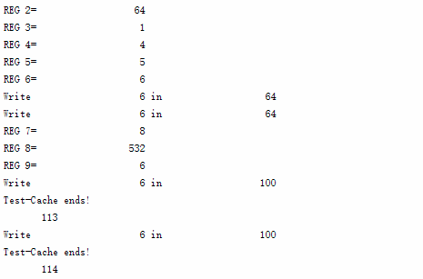
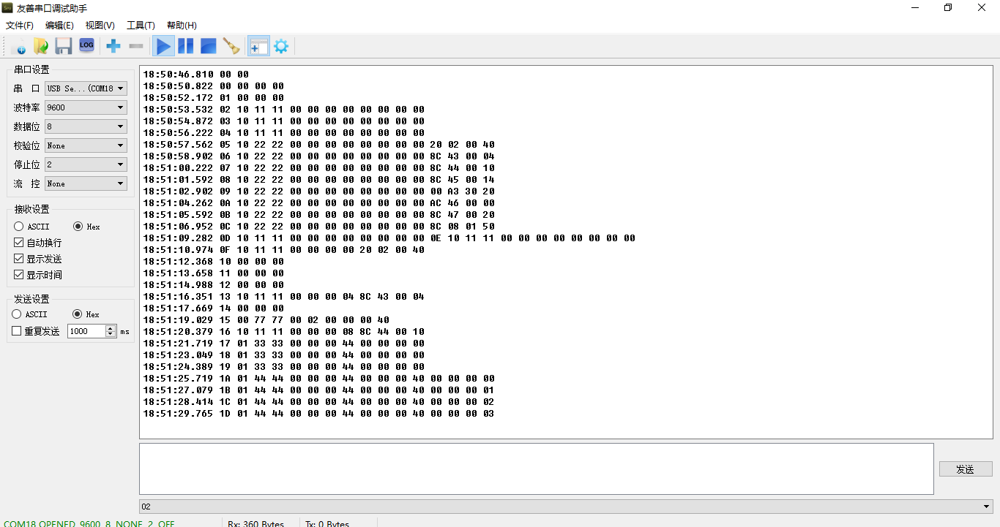
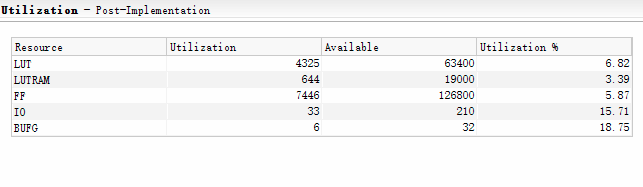
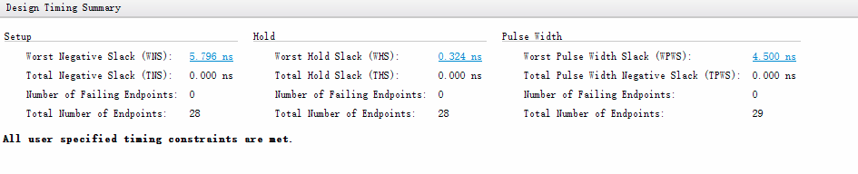

# MIPS_V3.2——流水线+Cache

姓名 学号

[TOC]

## 一、项目概述

本次实验是本学期ICS的最后一次实验，因为陈老师出差、微电的助教只在周一有空，我能得到的帮助非常少。一开始我完全按照自己的思路来写，虽然仿真成功了，但综合一次要20多分钟，出现了bug也不知道如何解决。没有办法，我只能借鉴网上的资料进行重写。因为期末季时间实在有限，我只实现了基本的32位读写cache，没有完全适配原来的64位CPU。

我用直接相连的方式实现了可读写的数据缓存dcache，用LRU两路组相连的方式实现了只读的指令缓存icache，并用串口调试的方式完美地展示了cache操作的全过程。

## 二、项目文件

**根目录（/）**

```
/bit/                   存放可以加载到Nexys4实验板上的各种二进制文件
/test/                  存放各种版本的汇编文件(.s)、十六进制文件(.dat)
/images/                存放实验报告所需的图片(.png)
/source/                源代码(.sv)
/Reference/             参考文献，包括上次的实验报告等
.gitignore              git配置文件
memfile.dat             当前使用的十六进制文件（每行两条指令）
README.md               实验报告
Nexys4DDR_Master.xdc    Nexys4实验板引脚锁定文件
simulation_behav.wcfg   仿真波形图配置文件
```

**源代码（/source/）**

```
onboard.sv              在Nexys4实验板上测试的顶层模块
simulation.sv           仿真时使用的顶层模块
top.sv                  包含mips和内存的顶层模块
mips.sv                 mips处理器的顶层模块
icache.sv               <新增>可读的指令缓存
dcache.sv               <新增>可读写的数据缓存
mem.sv                  指令和数据的混合存储器
```

**可复用模块（/source/utils/）**

与上次实验相同，详见<a href="/Reference/Report.pdf">Reference/Report.pdf</a> 

**MIPS控制单元（/source/controller/）**

与上次实验相同，但其中增加了readreq的控制信号输出

**MIPS数据通路（/source/datapath/）**

与上次实验相同，但增加了对指令读取延迟和数据读取停等的支持

**串口调试模块（/source/uart/）**

与上次实验相同，详见<七、串口原理>

## 三、系统结构

整个MIPS处理器的内部结构没有改变，系统的主要改变在于处理器和内存之间的连接，也就是顶层模块top。下面是top.sv的部分代码，我们可以看到mips处理器与指令缓存icache和数据缓存decahe相连，而不是与内存mem相连。同时，icache和mem之间通过instrreq0, instrval0, instraadr0, instr0连接，用于传输指令；dcache和mem之间通过writereq0, writeadr0, writedata0, writeval0来写数据进入内存，通过readreq0, readadr0, readdata0, readval0来读数据进入缓存。在这样的架构下，从mem到mips的数据传输变得复杂，但整个系统却提升了效率。对于整个系统的详细介绍，请参考上次的报告。

```verilog
mips    mips(clk,reset,
            datareq,dataadr,writedata,memwrite,
            instradr,instr,instrreq,
            dataabort,instrabort,readdata,
            pclow,checkra,checkr,regwriteW,writeregW);
mem     mem(clk,reset,
            writereq0,readreq0,writeadr0,writedata0,
            instradr0,instr0,instrreq0,
            instrval0,readval0,writeval0,
            readadr0,readdata0,checkma,checkm);
icache icache(clk,reset,
            instr0,instrval0,instrreq0,instradr0,
            instradr,instrreq,instr,ihit,instrabort);
dcache dcache(clk,reset,
            writereq0,writeadr0,writedata0,writeval0,
            readreq0,readadr0,readdata0,readval0,
            dataadr[31:0],datareq,memwrite[0],
            writedata[31:0],readdata[31:0],dhit,dataabort);
```

## 四、实验原理

我的数据缓存部分使用直接映射的方法实现，每个块的大小为256位（即8个字），缓存中总共存储8个块。每个块除了存储256位的数据外，还有24位的tag，1位的dirty和1位的val，共282位。每个数据在内存的地址由tag(24), block_id(3) 和块内地址(5)依次拼接而成。

在dcache模块中，首先是处理CPU写数据到cache和cache读memory数据的代码。因为在写cache前，cache必须确保其中的数据为最新的，所以在这段代码中，先判断是否读memory完毕，再处理命中的情况和未命中的情况。其中未命中时，需要延后写cache。为了判定是否还处于mem_read的状态，我们利用mem_read_req延后一个时钟周期的状态mem_read_req_delay与其对比。同样的，我还使用了其它一些信号的延后信号。

其次，我们还需要处理从cache写数据入memory和从cache读数据到CPU的代码，但这两块相对独立，代码较为简单。随后，我们还需要设计dcache的控制部分，决定什么时候向memory请求数据，什么时候向memory写入一整个块。最后，我们要实现了一个计数模块和位寄存器，来实现与memory的具体通讯。

以下为dcache的代码框架，具体的代码见source文件下的dcache.sv

```verilog
`timescale 1ns / 1ps

module    dcache(
    input   logic           clk,       
    input   logic           reset,     
    
	......
    
    output  logic           abort_out
  );
    
           
    logic   [281:0] block_data; 
    logic   [281:0] dcache[7:0];

    ......

    
    assign  mem_write_addr  =   {tag_delay,block_id_delay,5'b0};
    assign  mem_read_addr   =   {dataaddr_delay[31:5],5'b0};
    
    assign  block_id_delay  =   dataaddr_delay[7:5];
    assign  block_id        =   dataaddr[7:5];

    // CPU写cache 和 cache读memory
    always@(posedge clk)begin
        if(reset) begin
            ...
        end
        else if(mem_read_ready) begin
            // 当从memory读取完毕时，把位移寄存器里的数据写入块
            ...
        end
        else if(hit & datareq & wren) begin
            // 缓存命中，直接写入cache块中
     		...
        end
        else if(cpu_write_wait_flag & mem_read_req_delay & ~mem_read_req)begin
            // 发生缺失，延后写入cache
        	...
        end
    end

    // 从cache写入memory
	always@(posedge clk) begin
        ...
    end
    
    // 从cache读到CPU  
    assign    readdata    =    word;
    assign    block_data  =    dcache[block_id];

   	always@(posedge clk) begin
        ...
    end
    
    // 控制部分

    assign  hit     =   block_data[281] & (dataaddr[31:8]==block_data[279:256]);    
    assign  dirty   =   block_data[280];

    logic   abort, abort_delay;
    logic   reqstart;

    // 控制状态机
    parameter    CPU_EXEC   =    0;
    parameter    WR_DRAM    =    1;
    parameter    RD_DRAM    =    2;

    ......
    
    assign    mem_write_req   =    (WR_DRAM == state);
    assign    mem_read_req    =    (RD_DRAM == state);
    
    // 信号延迟部分
 
	......
    
    // 读写计数部分，用于判定读写memory是否完成
    parameter    BLOCK_SIZE =    8;
    
    assign mem_write_ready  =   (BLOCK_SIZE == write_counter);
    assign mem_read_ready   =   (BLOCK_SIZE == read_counter);
    
	......
    
    // 8字的移位寄存器，用于接收从memory读取的数

	......
    
endmodule
```

我的指令缓存部分使用LRU两路组相连的方式实现，每个块的大小为256位（即8个字），缓存中总共存储8个块。每个块除了存储256位的数据外，还有24位的tag和1位的dirty，共281位。每个数据在内存的地址由tag(24), block_id(3) 和块内地址(5)依次拼接而成。

在icache模块中，只需要实现从memory读指令到cache和从icache读指令到CPU两个主要功能。从icache读指令到CPU的部分比较简单，而从memory读指令到cache时，如果需要替换块，就要根据LRU队列中的优先级选择被替换的块。我们随后需要实现的就是LRU计数模块，这段的代码比较长，但实际上只是对计算过程进行了循环展开。根据网上介绍的经验（以及我实测的结果），这样的写法可以大大地减少综合的时间。和decache相同，我还在后面的代码中实现了icache的控制信号、icache内部分信号的延迟和一个循环寄存器。

以下为icache的代码框架，具体的代码见source文件下的icache.sv

```verilog
`timescale 1ns / 1ps
module    icache(
    input   logic           clk,
    input   logic           reset,
    
	......
    
    );
    

    logic   [280:0] block_data0, block_data1; 
    logic   [280:0] block_data;
    logic   [280:0] icache0[7:0], icache1[7:0];
    logic   [3:0]   LRU_c0[7:0], LRU_c1[7:0];
        
	......
    
    assign  block_id = instraddr[7:5];
    assign  block_id_delay = instraddr_delay[7:5];
    
    
    // 从memory读指令到icache
    assign  wr_cache_data = {1'b1, instraddr_delay[31:8],
                             mem_data_shift[7],mem_data_shift[6],
                             mem_data_shift[5],mem_data_shift[4],
                             mem_data_shift[3],mem_data_shift[2],
                             mem_data_shift[1],mem_data_shift[0]};
    
    always@(posedge clk)
    begin
        if(reset)begin
            
            ...
            
        end
        else if(mem_data_ready)
            if(icache0[block_id_delay][280] && icache1[block_id_delay][280])
            begin
                if(LRU_c0[block_id_delay] > LRU_c1[block_id_delay])
                      icache0[block_id_delay] <= wr_cache_data;
                else icache1[block_id_delay] <= wr_cache_data;
            end
            else if(icache0[block_id_delay][280])
                icache1[block_id_delay] <= wr_cache_data;
            else
                icache0[block_id_delay] <= wr_cache_data;
    end
    
    //从icache读指令到CPU
    
    always@(*)
        case(instraddr_delay[4:2])
            0:    instr = block_data[31:0];
			......           
            7:    instr = block_data[255:224];
        endcase
    
    //LRU 计数模块
    
    always @(posedge clk)
        //更新LRU队列
       	...
        
    
    always @(posedge clk)
		//更新block_data
        ...
    
    // 控制信号
    assign  hit0 = block_data0[280] & (instraddr_delay[31:8]==block_data0[279:256]);
    assign  hit1 = block_data1[280] & (instraddr_delay[31:8]==block_data1[279:256]);
    assign  hit  = hit0 | hit1;

    logic   abort, abort_delay;
    assign  abort_out   = abort | abort_delay;
    assign  abort       = (~hit & ins_req_delay) | mem_req | mem_req_delay;
    
    assign  block_data = hit1 ? block_data1 : block_data0;
    
	......	
    
    assign mem_addr = {instraddr_delay[31:5],5'b0};
    
    // 延迟信号
        
	......

    //统计读取的数据数量
    
    parameter BLOCK_SIZE = 8;
    assign  mem_data_ready = (BLOCK_SIZE==counter);    
    
	......
    
    // 从memory读取数据的位移寄存器
    
	......
    
endmodule
```

## 五、仿真测试

我们的测试程序是一段简单的读写程序

```assembly
# testcache.s
main:   addi    $2, $0, 64        
        lw      $3, 4($2)                     
        lw      $4, 16($2)                     
        lw      $5, 20($2)
        add     $6, $5, $3    
        sw      $6, 0($2)
        lw      $7, 32($2)
        lw      $8, 336($0)
        lw      $9, 24($2)
        sw      $9, 36($2)                 
```

但重要的是它的数据部分。我们可以看到文件的前几行是指令，后面有大量的数据，其中第`lw $8, 336($0)`这条指令会和`lw $4, 16($2)`、`lw $5, 20($2)`等指令读取的数据块在缓存中映射的位置相同，我们会看到数据块写回内存，数据块读取等操作。

```assembly
# testcache.dat
200200408c430004
8c4400108c450014
00a33020ac460000
8c4700208c080150
8c490018ac490024
0000000000000000
0000000000000000
0000000000000000
0000000000000001
0000000000002003
0000000400000005
0000000600000007
0000000800000009
0000000a0000000b
0000000c0000000d
0000000e0000000f
0000010000000101
0000010200000103
0000010400000105
0000010600000107
0000010800000109
0000010a0000010b
0000010c0000010d
0000010e0000010f
0000011000010111
0000011200000113
0000011400000115
0000011600000117
0000011800000119
0000011a0000011b
0000011c0000011d
0000011e0000011f
0000020000000001
0000020000002003
0000020400000005
0000020600000007
0000020800000009
0000020a0000000b
0000020c0000000d
0000020e0000020f
0000020000010211
0000021200000213
0000021400000215
0000021600000217
0000021800000219
0000021a0000021b
0000021c0000021d
0000021e0000011f
```

仿真的过程中会输出写入寄存器和写入cache/内存的情况，我们可以看到程序每一步执行的结果都是正确的（写入至少需要两个周期，所以会输出两次）




我们还可以通过波形图查看更多的细节，在这份实验报告里略去。

## 六、实验演示

这一次我选择了以串口调试输出为主的演示方式，虽然原来实验板上的大部分调试功能仍然存在，但实在是不方便查看，所以我也没有改进了。我的串口调试演示需要使用串口调试助手接收Nesxy4实验板通过串口发回的数据（如下图所示）。在每个MIPS的时钟周期内，实验板会发回一段长度2字~16字不等长度的十六进制数据，用于表示当前的状态。输出结果的控制代码详见top.sv中。



串口调试的输出情况有两大种，括号中的数字表示数据长度（单位：字）

**RESET：00 00**

**正常运行：CLKS(1)    读取情况 (1)   状态码(2)   其它参数**

正常运行的一个示例如下：

**07 10 22 22 00 00 00 00 00 00 00 00 8C 44 00 10**  

CLKS=**07**  读取情况=**10** (读指令中)    状态码=**22 22** (icache从memory读取一整块的指令)   其它参数共12字

**读取情况**有四种，如下表所示：

| 代码 | 情况                  |
| ---- | --------------------- |
| 00   | 没有读指令或读写数据  |
| 10   | 正在读指令            |
| 01   | 正在读/写数据         |
| 11   | 同时读指令和读/写数据 |

读指令和读写数据可能同时进行  部分时候**读取情况=11**，但状态码与其它参数显示只能其中一种，在我的演示方案中，我选择了优先显示读写数据（注意：并不是状态码越小越有限）。

正常运行时**状态码**与**其它参数**详见下表：

| 状态码 | 状态                                         | 其它参数                                   |
| ------ | -------------------------------------------- | ------------------------------------------ |
| 00 00  | 流水线正常运行，可能是alu计算，regfile读取等 |                                            |
| 11 11  | MIPS从icache读取指令的过程                   | 指令地址(4)  指令(4)                       |
| 22 22  | icache从memory读取一整块的指令               | 指令地址(4)  块首地址(4) 正在读取的指令(4) |
| 33 33  | MIPS从dcache读取数据的过程                   | 数据地址(4)  读出数据(4)                   |
| 44 44  | dcache从memory读取一整块的指令               | 数据地址(4)  块首地址(4) 正在读取的数据(4) |
| 55 55  | MIPS向dcache写入数据                         | 数据地址(4)  写入数据(4)                   |
| 66 66  | dcache向memory写入一整块的数据               | 数据地址(4)  块首地址(4) 正在写入的数据(4) |
| 77 77  | MIPS保存数据到regfile                        | 寄存器名称(2) 写入数据(4)                  |

下面是一次运行时中串口输出的结果，我会结合它进行详细的分析。其中流水线中Fetch阶段（至少三个周期）和Memory阶段（至少两个周期）的时间是会变化的。

```php+HTML
17:26:35.370 00 00 
17:26:41.033 00 00 
17:26:43.418 00 00 00 00 
17:26:44.761 01 00 00 00 
	<--下面开始读第一条指令-->
17:26:46.122 02 10 11 11 00 00 00 00 00 00 00 00 
17:26:47.450 03 10 11 11 00 00 00 00 00 00 00 00 
17:26:48.794 04 10 11 11 00 00 00 00 00 00 00 00 
	<--发现icache没有该指令，开始从内存读取一整块指令-->
17:26:50.137 05 10 22 22 00 00 00 00 00 00 00 00 20 02 00 40 
17:26:51.482 06 10 22 22 00 00 00 00 00 00 00 00 8C 43 00 04 
17:26:52.825 07 10 22 22 00 00 00 00 00 00 00 00 8C 44 00 10 
17:26:54.170 08 10 22 22 00 00 00 00 00 00 00 00 8C 45 00 14 
17:26:55.513 09 10 22 22 00 00 00 00 00 00 00 00 00 A3 30 20 
17:26:56.858 0A 10 22 22 00 00 00 00 00 00 00 00 AC 46 00 00 
17:26:58.201 0B 10 22 22 00 00 00 00 00 00 00 00 8C 47 00 20 
17:26:59.545 0C 10 22 22 00 00 00 00 00 00 00 00 8C 08 01 50 
   	<--一整块指令读取完毕-->
17:27:00.873 0D 10 11 11 00 00 00 00 00 00 00 00 
17:27:02.202 0E 10 11 11 00 00 00 00 00 00 00 00 
17:27:03.561 0F 10 11 11 00 00 00 00 20 02 00 40 
   	<--第一条指令读取完毕-->  
17:27:04.889 10 00 00 00 
17:27:06.233 11 00 00 00 
17:27:07.578 12 00 00 00    
    <--第二条指令可以直接读取-->
17:27:08.938 13 10 11 11 00 00 00 04 8C 43 00 04 
17:27:10.265 14 00 00 00   
    <--第一条指令的Writeback阶段-->
17:27:11.609 15 00 77 77 00 02 00 00 00 40 
    <--第三条指令的Fetch阶段-->
17:27:12.954 16 10 11 11 00 00 00 08 8C 44 00 10 
	<--第二条指令读取dcache中的数据-->
17:27:14.297 17 01 33 33 00 00 00 44 00 00 00 00 
17:27:15.641 18 01 33 33 00 00 00 44 00 00 00 00 
17:27:16.985 19 01 33 33 00 00 00 44 00 00 00 00 
	<--dcache中没有，开始从内存读取整块的数据-->
17:27:18.329 1A 01 44 44 00 00 00 44 00 00 00 40 00 00 00 00 
17:27:19.673 1B 01 44 44 00 00 00 44 00 00 00 40 00 00 00 01 
17:27:21.017 1C 01 44 44 00 00 00 44 00 00 00 40 00 00 00 02 
17:27:22.361 1D 01 44 44 00 00 00 44 00 00 00 40 00 00 00 03 
17:27:23.705 1E 01 44 44 00 00 00 44 00 00 00 40 00 00 00 04 
17:27:25.049 1F 01 44 44 00 00 00 44 00 00 00 40 00 00 00 05 
17:27:26.393 20 01 44 44 00 00 00 44 00 00 00 40 00 00 00 06 
17:27:27.705 21 01 44 44 00 00 00 44 00 00 00 40 00 00 00 07 
	<--整块的数据读取完毕-->
17:27:29.065 22 01 33 33 00 00 00 44 00 00 00 00 
17:27:30.393 23 01 33 33 00 00 00 44 00 00 00 00 
17:27:31.753 24 01 33 33 00 00 00 44 00 00 00 01 
	<--第二条指令的Writeback阶段--> 
17:27:33.081 25 00 77 77 00 03 00 00 00 01 
    <--第四条指令的Fetch阶段--> 
17:27:34.441 26 10 11 11 00 00 00 0C 8C 45 00 14 
    <--第三条指令用两个周期就读取到了cache中的数据-->   
17:27:35.769 27 01 33 33 00 00 00 50 00 00 00 00 
17:27:37.113 28 01 33 33 00 00 00 50 00 00 00 04   
    <--第三条指令的Writeback阶段-->   
17:27:38.457 29 00 77 77 00 04 00 00 00 04 
17:27:39.625 2A 10 11 11 00 00 00 10 00 A3 30 20 
17:28:07.992 2B 01 33 33 00 00 00 54 00 00 00 00 
17:28:09.336 2C 01 33 33 00 00 00 54 00 00 00 05 
17:28:10.664 2D 00 77 77 00 05 00 00 00 05 
17:28:12.008 2E 10 11 11 00 00 00 14 AC 46 00 00 
17:28:13.352 2F 00 00 00 
17:28:14.696 30 00 77 77 00 06 00 00 00 06 
    <--第七条指令的Fetch阶段>    
17:28:16.024 31 10 11 11 00 00 00 18 8C 47 00 20 
    <--第六条指令直接写入了cache，花费两个时钟周期>
17:28:17.383 32 01 55 55 00 00 00 40 00 00 00 06 
17:28:18.727 33 01 55 55 00 00 00 40 00 00 00 06 
17:28:20.072 34 00 77 77 00 06 00 00 00 06 
    <--第八条指令的Fetch阶段>           
17:28:21.416 35 10 11 11 00 00 00 1C 8C 08 01 50 
    <--第七条指令的Memory阶段，同样需要先读入一个块的数据进入decahe>           
17:28:22.760 36 01 33 33 00 00 00 60 00 00 00 00 
17:28:24.088 37 01 33 33 00 00 00 60 00 00 00 00 
17:28:25.448 38 01 44 44 00 00 00 60 00 00 00 60 00 00 00 08 
17:28:26.760 39 01 44 44 00 00 00 60 00 00 00 60 00 00 00 09 
17:28:28.119 3A 01 44 44 00 00 00 60 00 00 00 60 00 00 00 0A 
17:28:29.447 3B 01 44 44 00 00 00 60 00 00 00 60 00 00 00 0B 
17:28:30.808 3C 01 44 44 00 00 00 60 00 00 00 60 00 00 00 0C 
17:28:32.136 3D 01 44 44 00 00 00 60 00 00 00 60 00 00 00 0D 
17:28:33.496 3E 01 44 44 00 00 00 60 00 00 00 60 00 00 00 0E 
17:28:34.823 3F 01 44 44 00 00 00 60 00 00 00 60 00 00 00 0F 
17:28:36.168 40 01 33 33 00 00 00 60 00 00 00 00 
17:28:37.511 41 01 33 33 00 00 00 60 00 00 00 00 
17:28:38.856 42 01 33 33 00 00 00 60 00 00 00 08 
    <--第七条指令的Writeback阶段-->
17:28:40.199 43 00 77 77 00 07 00 00 00 08 
    <--第九条指令的Fetch阶段，这次又需要读入一整块的指令到icache-->
17:28:41.543 44 10 11 11 00 00 00 20 00 00 00 00
    <--第八条指令的Memory阶段-->
17:28:42.888 45 11 33 33 00 00 01 50 00 00 00 00 
17:28:44.231 46 11 33 33 00 00 01 50 00 00 00 00 
17:28:45.575 47 11 33 33 00 00 01 50 00 00 00 00 
	<--读取数据未命中，数据块对应的块已被占用，而且还是脏块，所以需要先把脏块写入内存-->
17:28:46.920 48 11 66 66 00 00 01 50 00 00 00 00 00 00 00 06 
17:28:48.263 49 11 66 66 00 00 01 50 00 00 00 00 00 00 00 01 
17:28:49.607 4A 11 66 66 00 00 01 50 00 00 00 00 00 00 00 02 
17:28:50.951 4B 11 66 66 00 00 01 50 00 00 00 00 00 00 00 03 
17:28:52.263 4C 11 66 66 00 00 01 50 00 00 00 00 00 00 00 04 
17:28:53.623 4D 11 66 66 00 00 01 50 00 00 00 00 00 00 00 05 
17:28:54.951 4E 11 66 66 00 00 01 50 00 00 00 00 00 00 00 06 
17:28:56.311 4F 11 66 66 00 00 01 50 00 00 00 00 00 00 00 07 
	<--上面一系列输出的读取情况为11，表示在写数据进内存的同时，还在读指令到icache-->
17:28:57.639 50 11 33 33 00 00 01 50 00 00 00 00 
17:28:58.999 51 01 33 33 00 00 01 50 00 00 00 00 
	<--脏块写入完毕，读取新的块-->
17:29:00.327 52 01 44 44 00 00 01 50 00 00 01 40 00 00 02 00 
17:29:01.687 53 01 44 44 00 00 01 50 00 00 01 40 00 01 02 11 
17:29:03.015 54 01 44 44 00 00 01 50 00 00 01 40 00 00 02 12 
17:29:04.359 55 01 44 44 00 00 01 50 00 00 01 40 00 00 02 13 
17:29:05.703 56 01 44 44 00 00 01 50 00 00 01 40 00 00 02 14 
17:29:07.046 57 01 44 44 00 00 01 50 00 00 01 40 00 00 02 15 
17:29:08.391 58 01 44 44 00 00 01 50 00 00 01 40 00 00 02 16 
17:29:09.735 59 01 44 44 00 00 01 50 00 00 01 40 00 00 02 17 
17:29:11.079 5A 01 33 33 00 00 01 50 00 00 00 00 
17:29:12.406 5B 01 33 33 00 00 01 50 00 00 00 00 
17:29:13.751 5C 01 33 33 00 00 01 50 00 00 02 14 
	<--新的块读取完毕，第八条指令执行完毕-->
17:29:15.079 5D 00 77 77 00 08 00 00 02 14 
17:29:16.439 5E 00 00 00 
17:29:17.767 5F 10 11 11 00 00 00 24 AC 49 00 24 
    <--第九条指令读数据，又替换成前面的数据块，但这次不需要写回脏块。可以看到内存已经被更改-->
17:29:19.127 60 01 33 33 00 00 00 58 00 00 00 00 
17:29:20.455 61 01 33 33 00 00 00 58 00 00 00 00 
17:29:21.815 62 01 44 44 00 00 00 58 00 00 00 40 00 00 00 06 
17:29:23.143 63 01 44 44 00 00 00 58 00 00 00 40 00 00 00 01 
17:29:24.502 64 01 44 44 00 00 00 58 00 00 00 40 00 00 00 02 
17:29:25.831 65 01 44 44 00 00 00 58 00 00 00 40 00 00 00 03 
17:29:27.191 66 01 44 44 00 00 00 58 00 00 00 40 00 00 00 04 
17:29:28.519 67 01 44 44 00 00 00 58 00 00 00 40 00 00 00 05 
17:29:29.863 68 01 44 44 00 00 00 58 00 00 00 40 00 00 00 06 
17:29:31.207 69 01 44 44 00 00 00 58 00 00 00 40 00 00 00 07 
17:29:32.551 6A 01 33 33 00 00 00 58 00 00 00 00 
17:29:33.895 6B 01 33 33 00 00 00 58 00 00 00 00 
17:29:35.238 6C 01 33 33 00 00 00 58 00 00 00 06 
17:29:36.566 6D 00 77 77 00 09 00 00 00 06 
17:29:37.911 6E 10 11 11 00 00 00 28 00 00 00 00 
17:29:39.254 6F 01 55 55 00 00 00 64 00 00 00 06 
17:29:40.583 70 01 55 55 00 00 00 64 00 00 00 06 
    <--最后一条指令执行完成，寄存器9被写入值6-->
17:29:41.942 71 00 77 77 00 09 00 00 00 06 
    <--可以看到后面读出的都是空指令，读指令需要3个时钟周期-->
17:29:43.270 72 10 11 11 00 00 00 2C 00 00 00 00 
17:29:44.615 73 00 00 00 
17:29:45.958 74 00 00 00 
17:29:47.318 75 10 11 11 00 00 00 30 00 00 00 00 
17:29:48.646 76 00 00 00 
17:29:49.991 77 00 00 00 
```

## 七、串口原理

串口调试部分的模块如下：

```
simu_uart.sv             用于仿真测试串口调试功能
uart_top.sv              串口调试顶层模块
bps_module.sv            控制发射速率的模块
rx_control_module.sv     rx控制模块
tx_control_module.sv     tx控制模块
test_module.sv           下降沿检测模块
```

uart_top是串口调试的主要模块，它接收了top模块经过onboard模块传来的tx_show和show_len两个参数，并检测mips的时钟下降沿。当mips时钟下降沿或者收到计算机通过串口发送的数据时，uart_top发信号给串口发送模块tx_control_module发送tx_sig信号，让其发送数据给电脑。当收到数据时，屏幕上返回原始数据（此处在上次实验中有查看内存的功能，但在这次实验不太必要）；当mips时钟下降沿时，发送top模块发送的数据。

```verilog
//uart_top.sv 节选
logic f1;
logic f2;

always@(negedge clk_trx,negedge rst_n)begin
    if(~rst_n)begin
            f1 <= 1'b1;
            f2 <= 1'b1;
    end
    else begin
            f1 <= clk_mips;
            f2 <= f1;
    end
end
assign tx_sig = (f2 & !f1) | rx_done_sig;
always @(posedge tx_sig)
    if(rx_done_sig)begin
        len = 5'd1;
        tx_data = rx_data;
    end
    else begin
        tx_data = tx_show;
        len <= show_len;
    end
```

tx_control_module是发送模块。串口一次只可以发送1bit的数据，但通过编码的方式，可将8bit的数据变成12bit的信道编码进行传输，在串口调试工具中设置好相应的参数即可解码成正确的十六进制数。在下面的代码中，i控制着12个bit的值，使得1byte的数据格式正确；cnt控制着不同byte的输出，使得要输出的数据按byte顺序输出。

```verilog
//tx_control_module.sv 节选

initial i <= 4'd0;
initial cnt <= 5'd0;
always@(posedge clk,negedge rst_n)
    if(!rst_n)
        i <= 4'd0;
        rx_data <= 8'd0;
        count_sig <= 1'b0;
        rx_done_sig <= 1'b0;
    else case(i)
            4'd0:if(tx_sig|cnt) begin
                i <= i + 1'b1;
                count_sig <= 1'b1; 
                if(tx_sig)
                    cnt <= len;
            end
            4'd1:if(bps_clk) begin i <= i + 1'b1;tx_pin_out <= 1'b0;end
            4'd2,4'd3,4'd4,4'd5,4'd6,4'd7,4'd8,4'd9:if(bps_clk) begin 
                i <= i + 1'b1;
                tx_pin_out <= tx_data[8*cnt+i-2-8];
            end
            4'd10,4'd11:if(bps_clk) begin i <= i + 1'b1;tx_pin_out <= 1'b1;end
            4'd12:if(bps_clk) begin 
                i <= 1'b0;
                count_sig <= 1'b0;
                cnt <= cnt-1;
            end 
    	endcase
    
bps_module bps_module(clk,rst_n,count_sig,bps_clk);
```

tx_control_module模块中调用了bps_module模块来调节发送的bps_clk，这个时钟的速度对应着串口调试工具设置的波特率的值。

rx_control_module模块与tx_control_module类似，即通过状态机对接收到的数据进行解码，使12bit的信道编码变成8bit的数据。它的工作离不开test_module下降沿检测模块，因为只有检测到rx端口的下降沿，才代表着数据输入的开始。

## 八、资源状况

资源占用情况如下：



时钟情况如下：



## 九、参考文献

1. <a href="/Reference/Cache.pdf">Cache.pdf</a> ：唐志强老师的PPT（修改自<计算机体系结构量化研究方法>的PPT）
2. <a href="/Reference/Report.pdf">Report.pdf</a> : 上次实验的实验报告

## 十、特别感谢

这学期ICS的课程到此结束啦\~我要感谢两位任课老师陈辰老师、金城老师地悉心教导，感谢三位助教的悉心指导。我同时还要特别感谢教我<数字逻辑>、<数逻实验>和<体系结构>三门课的唐志强老师，<数字逻辑>的C+让我痛定思痛，在以后的课程上投入更多时间去认真学习。希望我这门课可以拿到一个好成绩，给各位老师助教辛勤付出一个回报\~

